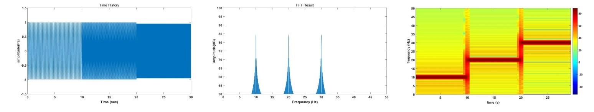
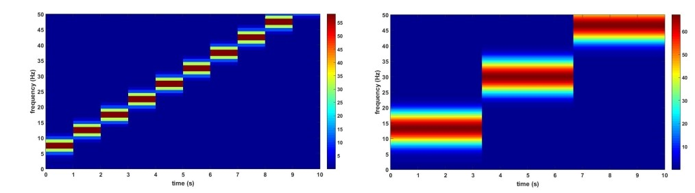
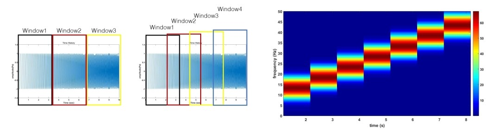
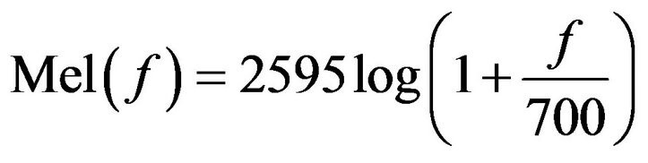
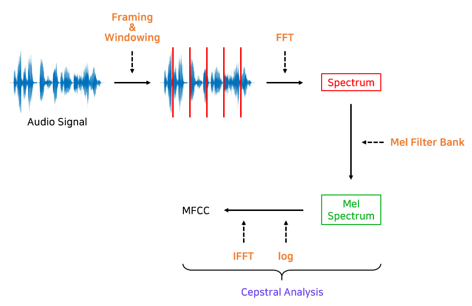
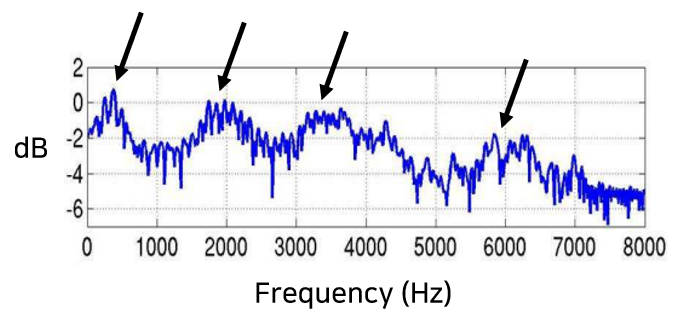

### 시계열 데이터 기초

> - Fourier Transform 
임의의 입력 신호를 다양한 주파수를 가지는 주기함수들의 합으로 표현하는 것
> - FFT(Fast Fourier Transform) 
DFT를 빠르게 수행하는 효율적인 알고리즘 
시간복잡도 DFT(n^2) / FFT(nlogn)
> - Sampling rate = Sampling Freq 
연속된 신호에서 얻어진 초단 sampling 횟수를 의미 / 단위 Hz
> - Nyquist Frequency (fn) 
FFT에 의해 결정될 수 있는 이론상 최대 주파수를 의미(fn = fs/2)
> - Block length/size or Window length/size 
FFT를 수행할 사이즈
> - Frequency resolution (df) 
두 측정 결과 간의 주파수 간격을 나타냄.(df = fs/BL)
> - Windowing
FFT는 DFT로 유한한 길이를 가지는 신호에 대한 변환이기 때문에 비주기적이며 주파수 영역에서 에너지가 퍼지는 “누설leakage”현상이 나타나게 됨 
window함수를 이용하여 불연속점을 채워 비주기 신호를 마치 주기적이며 연속적인 신호로 바꿔줌 

다양한 window 함수 
1. Flat Top       진폭의 정밀도를 높일 때 사용, 단일 주파수의 정밀 진폭 측정, 센서 교정시 사용 
2. Hanning        정상적인 연속 데이터 분석 시 사용, 일반적 진동 해석에 적용, 진폭치는 정확하지 않아도 정확한 진동수를 구별할 때  
3. Rectangular    시간 T안에서 현상이 종료되는 과도 데이터, Order Tracking 분석에 사용, 크기가 같은 근접 주파수를 분리하여 측정할 때 사용 
4. Exponential    다소 긴 시간 내에 현상이 종료되는 과도 데이터, Impulse Test 시 사용 
5. Kaiser-Bessel  크기가 다른 근접 주파수를 분리해석할 때 사용 

> - STFT(short time fourier transforms) 
 
시간에 대해 구간을 짧게 나누어 나누어진 여러 구간의 데이터를 각각 푸리에 변환하는 방법 
예) 9초 길이의 신호를 가정, 9초 전체에 대한 푸리에 변환x -> 3초 구간 3개로 나누어 각각 푸리에 변환o 
가운데 이미지(FFT)를 보면 어느 주파수 성분이 있는 지는 알 수 있지만 어느 시점에 어느 주파수 성분이 있는지는 알 수 없음 
오른쪽 이미지(STFT)를 보면 어느 주파수 성분이 어느 시점에 있는지 알 수 있음. 

#### 단점
STFT는 window length에 따라 분리하기 때문에 길이에 의한 분해능(resolution) 영향을 많이 받음 
length를 줄이면 주파수에 대한 분해능이 줄어들고 length를 늘리면 시간에 대한 분해능이 줄어듦 
 
(왼쪽   그림) window length가 작을경우 : 시간에 대한 분해능이 높음 / 주파수에 대한 분해능이 낮음 
(오른쪽 그림) window length가 클  경우 : 시간에 대한 분해능이 낮음 / 주파수에 대한 분해능이 높음 

> - Overlap 
 
Overlap = 70%로 설정하였을 때, 시간에 대한 분해능이 높아짐. (보통 50~75%를 사용한다고 함.)

> - Mel Spectogram 
 
사람들은 음성 신호를 인식할 때 주파수를 linear하게 인식하지 않음. 
보통 500 ~ 1000 Hz 구간을 예민하게 인식하고 10000Hz ~ 20000 Hz 구간을 잘 인식하지 못함. 
이러한 특성을 반영하여 FFT를 Transform 한 것 

> - MFCC 
 
MFCC 전체과정  
1. 오디오 신호를 프레임별(보통 20ms - 40ms)로 나누어 FFT를 적용해 Spectrum 구함. 
2. Spectrum에 Mel Filter Bank를 적용해 Mel Spectrum을 구함. 
3. Mel Spectrum에 Cepstral 분석을 적용해 MFCC를 구함. 

소리는 한 가지 주파수로만 구성되어 있지 않으며 기보ㄴ주파수와 함께 기본 주파수의 정수배인 배음들로 구성되어져 있음. 
예) 4옥타브 '라'(440Hz) 음을 연주 -> 440Hz뿐만 아니라 그 정수배인 880Hz, 그리고 그다음 배음들까지 포함 

배음 구조를 유추 -> 소리의 고유한 특징 
 
위 그림에서 화살표 부분은 Formant라고 하며 신호에서 지배적인 주파수 영역을 가르킴

<!-- Mel_spectogram, MFCC  -->

